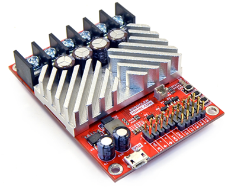
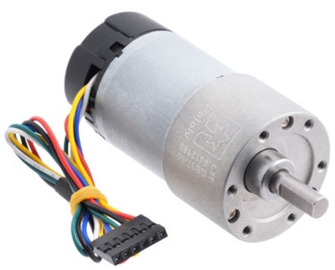
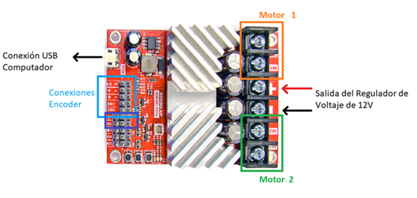
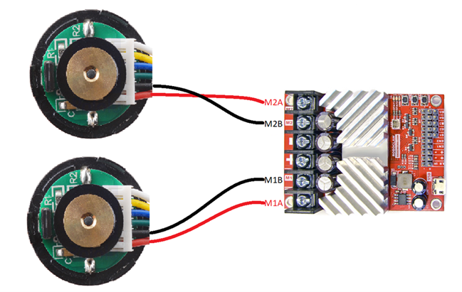
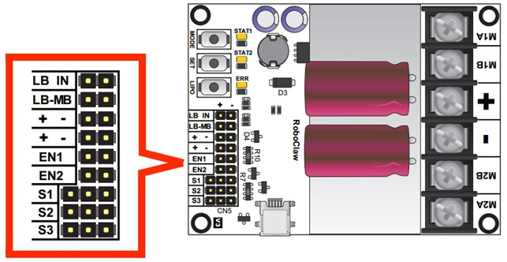
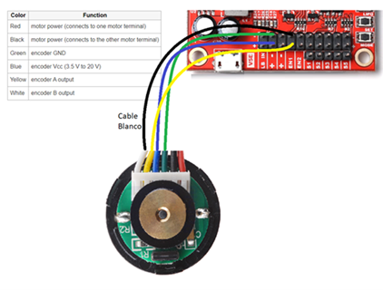
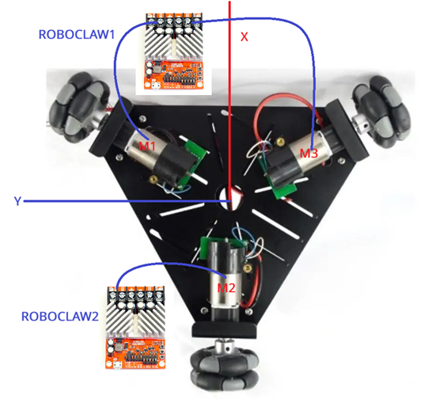
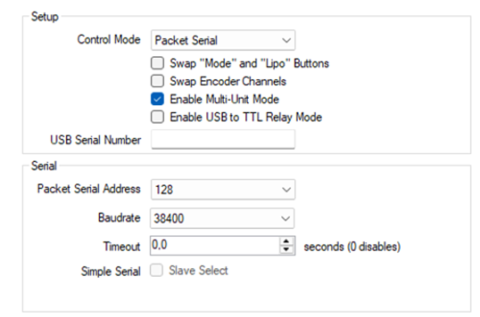
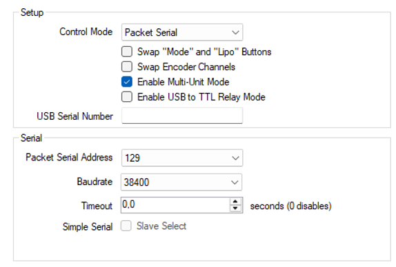

# 🔌 Conexiones RoboClaw y Motores

[← Volver al README principal](../../README.md)

---

> ⚠️ **NOTA DE SEGURIDAD:** No realizar conexiones eléctricas definitivas sin la supervisión previa del instructor para evitar accidentes y daños en los equipos.

---

## Tabla de contenidos

- [Descripción del hardware](#descripción-del-hardware)
- [Tipos de conexión](#tipos-de-conexión)
- [Conexiones de potencia](#conexiones-de-potencia)
- [Conexiones de los encoders](#conexiones-de-los-encoders)
- [Distribución de controladores y motores](#distribución-de-controladores-y-motores)
- [Configuración en BasicMicro Motion Studio](#configuración-en-basicmicro-motion-studio)

---

## Descripción del hardware

### Controlador RoboClaw (Basicmicro)

Los controladores de motores **RoboClaw** de Basicmicro son una familia de controladores de motores regenerativos sincrónicos, versátiles y eficientes. Características principales:

| Parámetro | Valores disponibles (según modelo) |
|---|---|
| Corriente continua | 7.5 A / 15 A / 30 A / 45 A / 60 A / 120 A / 300 A |
| Tensión de operación | 6V–34V / 6V–60V / 10.5V–60V |
| Picos de corriente | Muy por encima del valor nominal continuo |
| Canales de motor | 2 por controlador |

📄 Documentación oficial: [pololu.com/product/3285](https://www.pololu.com/product/3285)

### Motores — Motoreductores Pololu 37D

Los motores utilizados en el proyecto son **Motoreductores Pololu con piñón helicoidal**, serie **37D**.

📄 Documentación oficial: [pololu.com/product/4756](https://www.pololu.com/product/4756)

---

## Tipos de conexión

Cada motor requiere dos tipos de conexión con el RoboClaw:

- **Conexión de potencia** — Alimenta el motor con la corriente necesaria para su operación.
- **Conexión de encoder** — Permite al controlador leer la posición y velocidad del motor para control de lazo cerrado.

> Siga las instrucciones del instructor ya que se requieren ajustes mecánicos, eléctricos y por software antes de energizar el sistema.

---

## Conexiones de potencia

Cada motor se conecta a los terminales de potencia del canal correspondiente del RoboClaw:

| Canal | Terminales en RoboClaw |
|---|---|
| Motor 1 | `M1A` y `M1B` |
| Motor 2 | `M2A` y `M2B` |

---

## Conexiones de los encoders

Cada encoder se conecta al cabezal de encoder del canal correspondiente:

| Canal | Cabezal en RoboClaw |
|---|---|
| Encoder Motor 1 | `EN1` |
| Encoder Motor 2 | `EN2` |

---

## Distribución de controladores y motores

El sistema utiliza **dos controladores RoboClaw** para manejar los tres motores de la plataforma:

### RoboClaw 1 — Controlador Frontal (Motores 1 y 3)

Maneja las dos ruedas delanteras.

**Motor 1 — Delantero Izquierdo (60°)**
- Potencia: Conectar cables del motor a los terminales `M1A` y `M1B`
- Encoder: Conectar pines de señal al cabezal `EN1`

**Motor 3 — Delantero Derecho (-60°)**
- Potencia: Conectar cables del motor a los terminales `M2A` y `M2B`
- Encoder: Conectar pines de señal al cabezal `EN2`

---

### RoboClaw 2 — Controlador Trasero (Motor 2)

Maneja únicamente la rueda trasera.

**Motor 2 — Trasero (180°)**
- Potencia: Conectar cables del motor a los terminales `M1A` y `M1B`
- Encoder: Conectar pines de señal al cabezal `EN1`

> **Nota:** El segundo canal de este RoboClaw (`M2` y `EN2`) quedará libre para futuros usos.

---

## Configuración en BasicMicro Motion Studio

Conectar cada RoboClaw **por separado** a la PC con Windows 11 usando el cable USB para configurarlos individualmente.

> **Descarga de BasicMicro Motion Studio:** La aplicación está disponible en la [página oficial de BasicMicro](https://www.basicmicro.com/downloads?srsltid=AfmBOopEurS-ZyroLCO36JGYt1Z5SIpMfIyPDrahgUt3FHOG1E4xPhyH). O puede descargarla del siguiente [Drive](https://drive.google.com/file/d/1NNjtHRItZDIMq5WsSogL5o8KbV007Vm3/view?usp=sharing)
> - Para RoboClaw **V5E**: usar la versión **Legacy** de BasicMicro Motion Studio.
> - Para RoboClaw **V6E o superior**: usar la versión **estándar (actual)** de BasicMicro Motion Studio.

### RoboClaw 1 — (Motores 1 y 3)

**1. General Settings**
- Cambiar modo a `Packet Serial`
- Marcar `Enable Multi-Unit Mode`
- Dirección serial (Address): `128` (`0x80`)
- Baudios: `38400`

**2. PWM Settings — Verificación de dirección y encoder**

Deslizar hacia arriba el control del **Motor 1**:
- La rueda delantera izquierda debe **avanzar**
- El encoder `M1 Encoder` debe **contar en positivo**

Repetir con el **Motor 2** en el software (físicamente Motor 3 — delantero derecho):
- Debe girar hacia la dirección correcta al avanzar
- El encoder `M2 Encoder` debe **contar en positivo**

> Si al subir el valor de PWM positivamente el motor no gira en la dirección correcta o el encoder no incrementa positivamente, **intercambiar las conexiones de potencia y los cables del encoder** del canal correspondiente.

**3. Velocity Settings**
- Realizar **Auto-Tune** para ambos canales
- Guardar: `Device → Write Settings`

---

### RoboClaw 2 — (Motor 2)

**1. General Settings**
- Modo: `Packet Serial`
- Marcar `Enable Multi-Unit Mode`
- Baudios: `38400`
- Dirección serial (Address): `129` (`0x81`)

**2. PWM Settings — Verificación de dirección y encoder**

Subir el deslizador del **Motor 1** (rueda trasera física):
- Debe empujar hacia adelante según su propio eje
- El encoder `M1` debe **contar en positivo** al avanzar

**3. Velocity Settings**
- Realizar **Auto-Tune solo para Motor 1** (`Tune M1`)
- Guardar los parámetros: `Device → Write Settings`

---

[← Volver al README principal](../../README.md)

**Referencias:** [RoboClaw — Pololu](https://www.pololu.com/product/3285) &nbsp;|&nbsp; [Motor 37D — Pololu](https://www.pololu.com/product/4756)

