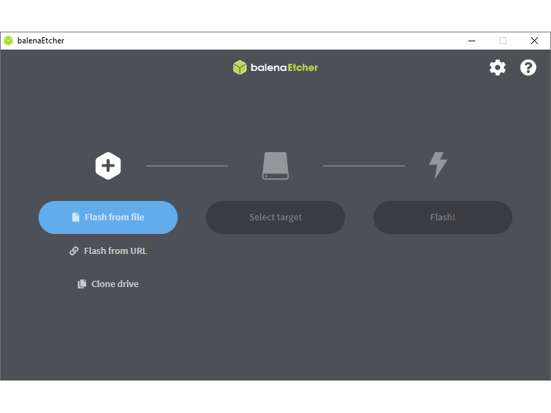

<div align="center">

# 💾 Grabación de imagen Ubuntu 18.04 en SD Card
### Jetson Nano Developer Kit — Usando Balena Etcher


[← Volver al README principal](../../README.md)

</div>

---

## Tabla de contenidos

- [Requisitos](#requisitos)
- [Paso 1 — Descargar la imagen](#paso-1--descargar-la-imagen)
- [Paso 2 — Descargar e instalar Balena Etcher](#paso-2--descargar-e-instalar-balena-etcher)
- [Paso 3 — Grabar la imagen en la SD](#paso-3--grabar-la-imagen-en-la-sd)
- [Paso 4 — Insertar la SD e iniciar la Jetson Nano](#paso-4--insertar-la-sd-e-iniciar-la-jetson-nano)
- [Primer arranque — Configuración inicial](#primer-arranque--configuración-inicial)
- [Verificar la instalación](#verificar-la-instalación)

---

## Requisitos

| Requisito | Detalle |
|---|---|
| Hardware | Jetson Nano Developer Kit (2019) |
| MicroSD | Mínimo **32 GB** — Clase 10 o UHS-1 recomendada |
| Lector SD | Incorporado en el PC o adaptador USB |
| PC host | Windows, macOS o Linux |
| Imagen | JetPack 4.6.x (Ubuntu 18.04) — ver Paso 1 |
| Software | Balena Etcher — ver Paso 2 |

> ⚠️ **Importante:** Usar una SD de al menos 32 GB. Con 16 GB la imagen instala, pero no queda espacio suficiente para ROS Melodic y los paquetes del proyecto.

---

## Paso 1 — Descargar la imagen

La imagen utilizada en este proyecto es la imagen oficial de JetPack 4.6.x para Jetson Nano Developer Kit, que incluye Ubuntu 18.04 LTS con los drivers de NVIDIA, CUDA, cuDNN y TensorRT preinstalados.

### Opción A — Imagen del repositorio del proyecto (recomendada)

Descarga la imagen directamente desde el Drive del proyecto:

> 📥 **[Descargar imagen JetPack 4.6 — Ubuntu 18.04 para Jetson Nano](https://drive.google.com/file/d/1EBNefUcER_sRsVlAv0mtyVe-OXfLNO6n/view?usp=sharing)**

### Opción B — Imagen oficial de NVIDIA

Si prefieres descargar directamente desde NVIDIA, la imagen oficial de la Jetson Nano Developer Kit está disponible en:

> 📥 **[developer.nvidia.com/embedded/learn/get-started-jetson-nano-devkit](https://developer.nvidia.com/embedded/learn/get-started-jetson-nano-devkit#write)**

Busca la sección **"Prepare for Setup"** → **"Download Image"**.

---

> Una vez descargada, la imagen llega como un archivo comprimido `.zip`. **No es necesario descomprimirlo** — Balena Etcher lo maneja directamente.

---

## Paso 2 — Descargar e instalar Balena Etcher

Balena Etcher es la herramienta recomendada para grabar imágenes de sistema operativo en tarjetas SD y USB. Es multiplataforma, gratuita y maneja automáticamente la descompresión del `.zip`.

Descárgalo desde:

> 📥 **[etcher.balena.io](https://etcher.balena.io)**

Selecciona la versión correspondiente a tu sistema operativo (Windows, macOS o Linux) e instálalo normalmente.

---

## Paso 3 — Grabar la imagen en la SD

### 3.1 Insertar la microSD en el lector

Inserta la microSD en el lector de tarjetas de tu PC. Si Windows muestra un aviso de formateo, haz clic en **Cancelar** — Etcher se encargará de todo.

### 3.2 Abrir Balena Etcher

Al abrir Etcher verás la interfaz principal con tres pasos claramente definidos:



### 3.3 Seleccionar la imagen — **Flash from file**

Haz clic en **"Flash from file"** y navega hasta el archivo `.zip` de la imagen que descargaste en el Paso 1.

> No es necesario descomprimir el `.zip`. Etcher lee el archivo comprimido directamente.

### 3.4 Seleccionar el destino — **Select target**

Haz clic en **"Select target"** y selecciona tu microSD de la lista de dispositivos disponibles.

> ⚠️ **Verifica bien el dispositivo seleccionado.** Etcher sobrescribe completamente el contenido del dispositivo. Si seleccionas un disco equivocado, perderás toda la información de ese disco.

### 3.5 Iniciar la grabación — **Flash!**

Haz clic en **"Flash!"** e ingresa tu contraseña si el sistema lo solicita.

El proceso tiene dos fases:
1. **Flashing** — Escribe la imagen en la SD (aproximadamente 10–15 minutos)
2. **Validating** — Verifica que la escritura fue correcta (aproximadamente 5 minutos)

> No retires la SD durante el proceso. Espera hasta que Etcher muestre el mensaje de éxito.

### 3.6 Finalización

Cuando Etcher muestre **"Flash Complete!"**, la grabación fue exitosa. Puedes retirar la microSD de forma segura.

---

## Paso 4 — Insertar la SD e iniciar la Jetson Nano

**1.** Con la Jetson Nano **apagada y sin alimentación**, inserta la microSD en la ranura ubicada en la parte inferior de la placa:

```
Ranura microSD → parte inferior de la Jetson Nano Developer Kit
                 debajo del módulo Jetson
```

**2.** Conecta periféricos:
   - Monitor (HDMI o DisplayPort)
   - Teclado y mouse (USB)
   - Cable de red (Ethernet) — recomendado para la configuración inicial

**3.** Conecta la alimentación (5V 4A mediante barrel jack o 5V mediante microUSB).

La Jetson Nano arrancará automáticamente al recibir alimentación.

---

## Primer arranque — Configuración inicial

El primer arranque puede tomar entre **1 y 3 minutos**. Verás el logo de NVIDIA y luego el asistente de configuración inicial de Ubuntu:

| Paso | Acción |
|---|---|
| Licencia | Aceptar los términos de NVIDIA y Ubuntu |
| Idioma | Seleccionar idioma del sistema |
| Distribución de teclado | Seleccionar la distribución correcta |
| Zona horaria | Configurar tu zona horaria |
| Usuario | Crear nombre de usuario y contraseña |
| Tamaño de partición | Seleccionar **"Maximum size"** para usar toda la SD |

> Elige **"Maximum size"** en la configuración de partición. De lo contrario, la SD quedará con espacio sin usar.

Al finalizar el asistente, el sistema reiniciará y arrancará directamente en el escritorio de Ubuntu 18.04.

---

## Verificar la instalación

Abre una terminal (`Ctrl + Alt + T`) y ejecuta los siguientes comandos para confirmar que la imagen se instaló correctamente:

**Verificar versión de Ubuntu:**

```bash
lsb_release -a
```

Salida esperada:
```
Distributor ID: Ubuntu
Description:    Ubuntu 18.04.x LTS
Release:        18.04
Codename:       bionic
```

**Verificar versión de JetPack:**

```bash
cat /etc/nv_tegra_release
```

Salida esperada (ejemplo para JetPack 4.6.4):
```
# R32 (release), REVISION: 7.6, ...
```

**Verificar que CUDA está disponible:**

```bash
nvcc --version
```

Salida esperada:
```
nvcc: NVIDIA (R) Cuda compiler driver
Cuda compilation tools, release 10.2, V10.2.89
```

Si los tres comandos responden correctamente, la Jetson Nano está lista para continuar con la instalación de ROS Melodic.

---

<div align="center">

[← Volver al README principal](../../README.md) &nbsp;|&nbsp; [Instalar ROS Melodic →](../ros1/jetson-nano-ros-melodic.md)

**Referencias:** [NVIDIA Jetson Nano Getting Started](https://developer.nvidia.com/embedded/learn/get-started-jetson-nano-devkit) &nbsp;|&nbsp; [Balena Etcher](https://etcher.balena.io)

</div>
