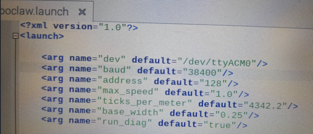

<div align="center">

# 🎛️ Instalación, Configuración y Pruebas del RoboClaw en ROS 1
### Librería `roboclaw_node` — Jetson Nano + ROS Melodic


[← Volver al README principal](../../README.md) &nbsp;

</div>

---

## Tabla de contenidos

- [Descripción](#descripción)
- [Requisitos previos](#requisitos-previos)
- [Paso 1 — Instalación de la librería](#paso-1--instalación-de-la-librería)
- [Paso 2 — Configuración de parámetros en roboclaw.launch](#paso-2--configuración-de-parámetros-en-roboclawlaunch)
- [Paso 3 — Configuración de parámetros en roboclaw_node.py](#paso-3--configuración-de-parámetros-en-roboclaw_nodepy)
- [Paso 4 — Permisos del puerto serial](#paso-4--permisos-del-puerto-serial)
- [Paso 5 — Lanzar el paquete](#paso-5--lanzar-el-paquete)
- [Resolución de errores](#resolución-de-errores)
- [Teleoperación con teclado](#teleoperación-con-teclado)
- [Depuración de odometría](#depuración-de-odometría)

---

## Descripción

La librería **`roboclaw_node`** es un paquete ROS 1 que permite controlar motores mediante el controlador RoboClaw de Basicmicro, publicando y suscribiéndose a topics estándar de ROS como `/cmd_vel` y `/odom`. Esta guía cubre la instalación, configuración de parámetros y resolución de los errores más comunes al usarla en la Jetson Nano con ROS Melodic.

**Repositorio fuente:**
> 🔗 [github.com/julianchaux/roboclaw_node](https://github.com/julianchaux/roboclaw_node)

---

## Requisitos previos

- Jetson Nano con ROS Melodic instalado y workspace `catkin_ws` configurado
- RoboClaw conectado vía USB (`/dev/ttyACM0`) y configurado con Basicmicro Motion Studio
  - Velocidad de baudios configurada: **38400**
  - Dirección serial: **128** (`0x80`)
- Motores con encoders conectados al RoboClaw
- Conexión a internet en la Jetson Nano

---

## Paso 1 — Instalación de la librería

Desde la Jetson Nano, abre una terminal y navega a la carpeta `src` del workspace:

```bash
cd ~/catkin_ws/src
```

Clona el repositorio:

```bash
sudo git clone https://github.com/julianchaux/roboclaw_node.git
```

Regresa al directorio raíz del workspace e instala las dependencias:

```bash
cd ..
rosdep install --from-paths src --ignore-src -r -y
```

Compila el workspace:

```bash
catkin_make
```

---

## Paso 2 — Configuración de parámetros en `roboclaw.launch`

El archivo de lanzamiento se encuentra en:

```
~/catkin_ws/src/roboclaw_node/roboclaw_node/launch/roboclaw.launch
```

<div align="center">

<br><em>Archivo roboclaw.launch — parámetros de configuración del controlador</em>
</div>

<br>

Los parámetros a ajustar son:

| Parámetro | Valor por defecto | Descripción |
|---|---|---|
| `dev` | `/dev/ttyACM0` | Puerto serial del RoboClaw asignado por el sistema |
| `baud` | `38400` | Velocidad de baudios — debe coincidir con la configurada en Basicmicro Motion Studio |
| `address` | `128` | Dirección serial del RoboClaw (ver guía de conexiones) |
| `max_speed` | `1.0` | Velocidad máxima del robot en m/s |
| `ticks_per_meter` | `4342.2` | Pulsos del encoder por metro recorrido — **requiere cálculo y ajuste** |
| `base_width` | `0.25` | Ancho de la base del robot en metros (distancia entre ruedas) |
| `run_diag` | `true` | Activar nodo de diagnóstico |

---

### Definición puerto serial asignado


### Cálculo de `ticks_per_meter`

El parámetro `ticks_per_meter` depende directamente del motor (reductor) y el diámetro de las ruedas del robot. El motor de referencia utilizado en este proyecto es:

<div align="center">

<br><em>Motor Pololu 47:1 Metal Gearmotor 25Dx67L mm HP 12V con encoder de 48 CPR — ítem #4845</em>
</div>

<br>

**Datos del motor:**
- Relación de reducción: **47:1**
- Encoder: **48 CPR** (counts per revolution del motor)
- Pulsos totales por revolución del eje de salida: `48 × 47 = 2256` pulsos
- El encoder entrega pulsos en cuadratura → `2256 × 4 = 2248.86` ticks efectivos por revolución

**Datos de las ruedas:**
- Diámetro de la rueda: **0.063 m** (6.3 cm)
- Perímetro de la rueda: `π × 0.063 = 0.198 m ≈ 0.20 m`

**Cálculo:**

```
revs/metro = 1 m ÷ 0.20 m = 5 revs/metro

ticks/metro = 2248.86 ticks × 5 = 11244.3
```

> ⚠️ **Este es un valor de partida.** El ajuste fino de `ticks_per_meter` se realiza a prueba y error comparando la odometría con el movimiento real del robot. Ver la sección [Depuración de odometría](#depuración-de-odometría).

---

## Paso 3 — Configuración de parámetros en `roboclaw_node.py`

El archivo del nodo se encuentra en:

```
~/catkin_ws/src/roboclaw_node/roboclaw_node/nodes/roboclaw_node.py
```

Abrir el archivo con nano:

```bash
nano ~/catkin_ws/src/roboclaw_node/roboclaw_node/nodes/roboclaw_node.py
```

**Líneas 143–144** — Puerto serial y velocidad de baudios:

<div align="center">

<br><em>Líneas 143–144: dev_name y baud_rate — deben coincidir con roboclaw.launch</em>
</div>

```python
dev_name = rospy.get_param("~dev", "/dev/ttyACM0")
baud_rate = int(rospy.get_param("~baud", "38400"))
```

**Líneas 179–181** — Velocidad máxima, ticks por metro y ancho de base:

<div align="center">

<br><em>Líneas 179–181: MAX_SPEED, TICKS_PER_METER y BASE_WIDTH</em>
</div>

```python
self.MAX_SPEED = float(rospy.get_param("~max_speed", "1.0"))
self.TICKS_PER_METER = float(rospy.get_param("~tick_per_meter", "..."))
self.BASE_WIDTH = float(rospy.get_param("~base_width", "0.25"))
```

> Guarda los cambios con `Ctrl+O`, `Enter`, y cierra con `Ctrl+X`.

---

## Paso 4 — Permisos del puerto serial

Antes de lanzar el paquete, es necesario dar permisos de acceso al puerto serial asignado al RoboClaw.

Verificar los permisos actuales del puerto:

```bash
ls -l /dev/ttyACM0
```

Otorgar permisos completos:

```bash
sudo chmod 777 /dev/ttyACM0
```

> **Nota:** Este comando debe ejecutarse cada vez que se reinicia la Jetson Nano, ya que los permisos del puerto `/dev/ttyACM0` se restablecen con cada arranque. Para hacerlo permanente, agregar el usuario al grupo `dialout`:
> ```bash
> sudo usermod -a -G dialout $USER
> ```
> Luego cerrar sesión y volver a entrar para que el cambio tenga efecto.

---

## Paso 5 — Lanzar el paquete

Con los parámetros configurados y el puerto con permisos, lanzar el nodo:

```bash
roslaunch roboclaw_node roboclaw.launch
```

Si todo está correcto, verás los mensajes de conexión exitosa al RoboClaw en la terminal.

---

## Resolución de errores

### Error 1 — Sin permisos de ejecución en `roboclaw_node.py`

Si al lanzar el paquete aparece el siguiente error:

<div align="center">

<br><em>Error: no se puede ejecutar el script — falta permiso de ejecución</em>
</div>

```
ERROR: cannot launch node of type [roboclaw_node/roboclaw_node.py]:
Cannot locate node of type [roboclaw_node.py] in package [roboclaw_node].
Make sure file exists in package path and permission is set to executable (+x).
```

**Causa:** El script `roboclaw_node.py` no tiene permiso de ejecución.

**Solución:**

Navega a la carpeta del nodo:

```bash
cd ~/catkin_ws/src/roboclaw_node/nodes
```

Verifica los archivos presentes:

```bash
ls
```

<div align="center">

<br><em>Carpeta nodes — archivos del paquete roboclaw_node</em>
</div>

<br>

Aplica el permiso de ejecución:

```bash
sudo chmod +x roboclaw_node.py
```

<div align="center">

<br><em>Aplicando permiso de ejecución al script del nodo</em>
</div>

---

### Error 2 — Módulo `serial` no encontrado

Si al lanzar el paquete aparece el siguiente error:

<div align="center">

<br><em>Error: ImportError — No module named serial</em>
</div>

```
ImportError: No module named serial
```

**Causa:** La librería Python `serial` no está instalada en el sistema.

**Solución:**

```bash
sudo apt install python-serial python3-serial
```

Después de instalar la librería, vuelve a lanzar el paquete:

```bash
roslaunch roboclaw_node roboclaw.launch
```

---

## Teleoperación con teclado

Para controlar el robot manualmente desde el teclado, instala el paquete `teleop_twist_keyboard`:

```bash
sudo apt-get install ros-melodic-teleop-twist-keyboard
```

En un terminal separado (con el nodo roboclaw ya corriendo), ejecuta:

```bash
rosrun teleop_twist_keyboard teleop_twist_keyboard.py
```

<div align="center">

<br><em>Interfaz de teleoperación — controlar el robot desde el teclado</em>
</div>

<br>

| Tecla | Acción |
|---|---|
| `u` `i` `o` | Avanzar con giro izquierda / recto / derecha |
| `j` `k` `l` | Girar izquierda / detener / girar derecha |
| `m` `,` `.` | Retroceder con giro izquierda / recto / derecha |
| `q` / `z` | Aumentar / disminuir velocidad máxima 10% |
| `w` / `x` | Aumentar / disminuir velocidad lineal 10% |
| `e` / `c` | Aumentar / disminuir velocidad angular 10% |
| `Ctrl+C` | Detener |

---

## Depuración de odometría

### Verificar los datos de odometría

Con el nodo corriendo, en un nuevo terminal ejecuta:

```bash
rostopic echo /odom
```

Mueve el robot con el teleop y observa si los valores de posición (`pose.position.x`, `pose.position.y`) corresponden al movimiento real.

---

### Corrección del signo en el eje Y

En algunas configuraciones la posición en `Y` aparece invertida. Para corregirlo, edita el archivo:

```bash
nano ~/catkin_ws/src/roboclaw_node/roboclaw_node/nodes/roboclaw_node.py
```

Dentro de la función `update`, busca la línea:

<div align="center">

<br><em>Función update — cálculo de odometría. La línea comentada con #d_theta muestra la corrección</em>
</div>

Localiza esta línea (aproximadamente):

```python
# LÍNEA ORIGINAL — posición Y invertida:
self.cur_y -= r * (cos(d_theta + self.cur_theta) - cos(self.cur_theta))
```

Cámbiala por:

```python
# LÍNEA CORREGIDA — signo + en lugar de -:
self.cur_y += r * (cos(d_theta + self.cur_theta) - cos(self.cur_theta))
```

Guarda los cambios (`Ctrl+O`, `Enter`, `Ctrl+X`) y vuelve a compilar:

```bash
cd ~/catkin_ws && catkin_make
```

---

### Ajuste fino de `ticks_per_meter`

Si la estimación de posición no corresponde con el movimiento real, ajusta el valor de `ticks_per_meter`. Este es un proceso iterativo.

> **Nota importante:** Este valor se define a prueba y error. Realiza las modificaciones según correspondan a tu robot específico. Para el robot de referencia de este proyecto, el valor aproximado que genera una estimación de posición correcta es **`ticks_per_meter = 37105`**.

El valor debe actualizarse en **dos archivos**:

**Archivo 1 — `roboclaw.launch`:**

```bash
nano ~/catkin_ws/src/roboclaw_node/roboclaw_node/launch/roboclaw.launch
```

<div align="center">

<br><em>roboclaw.launch — ticks_per_meter actualizado a 37105</em>
</div>

<br>

**Archivo 2 — `roboclaw_node.py`:**

```bash
nano ~/catkin_ws/src/roboclaw_node/roboclaw_node/nodes/roboclaw_node.py
```

<div align="center">

<br><em>roboclaw_node.py — TICKS_PER_METER actualizado a 37105 como valor por defecto</em>
</div>

<br>

Después de actualizar ambos archivos, vuelve a compilar y lanza el paquete:

```bash
cd ~/catkin_ws && catkin_make
roslaunch roboclaw_node roboclaw.launch
```

Verifica la odometría:

```bash
rostopic echo /odom
```

Mueve el robot y compara la posición reportada con el desplazamiento real. Si no coincide, ajusta el valor de `ticks_per_meter` y repite el proceso.

---

## Resumen del flujo completo

```bash
# 1. Clonar e instalar
cd ~/catkin_ws/src
sudo git clone https://github.com/julianchaux/roboclaw_node.git
cd .. && rosdep install --from-paths src --ignore-src -r -y && catkin_make

# 2. Permisos del puerto serial
sudo chmod 777 /dev/ttyACM0

# 3. Lanzar el nodo
roslaunch roboclaw_node roboclaw.launch

# 4. (Terminal separado) Teleop
rosrun teleop_twist_keyboard teleop_twist_keyboard.py

# 5. (Terminal separado) Verificar odometría
rostopic echo /odom
```

---

<div align="center">

[← Volver al README principal](../../README.md) &nbsp;|&nbsp; [← Conexiones RoboClaw y Motores](../hardware/roboclaw-motores.md)

**Repositorio:** [github.com/julianchaux/roboclaw_node](https://github.com/julianchaux/roboclaw_node) &nbsp;|&nbsp; [RoboClaw — Pololu](https://www.pololu.com/product/3285)

</div>
