<div align="center">

# 🛠️ Instalación de JetPack 6.2 con NVIDIA SDK Manager
### Jetson Orin NX 16 GB — NVMe SSD + Ubuntu 22.04
### Jetson Orin Nano 8 GB — NVMe SSD + Ubuntu 22.04


[← Volver al README principal](../../README.md) &nbsp;|&nbsp; [Instalar ROS 2 Humble →](ubuntu-deb.md)

</div>

---

## Tabla de contenidos

- [Descripción general](#descripción-general)
- [Requisitos](#requisitos)
- [Paso 1 — Instalación del SSD M.2 NVMe](#paso-1--instalación-del-ssd-m2-nvme)
- [Paso 2 — ¿Por qué usar Ubuntu 22.04 en el host?](#paso-2--por-qué-usar-ubuntu-2204-en-el-host)
- [Paso 3 — Descarga e instalación del SDK Manager](#paso-3--descarga-e-instalación-del-sdk-manager)
- [Paso 4 — Modo Recovery (conexión de pines)](#paso-4--modo-recovery-conexión-de-pines)
- [Paso 5 — Proceso dentro del SDK Manager](#paso-5--proceso-dentro-del-sdk-manager)
- [Paso 6 — Verificación por SSH](#paso-6--verificación-por-ssh)

---

## Descripción general

El **NVIDIA SDK Manager** es la herramienta oficial para flashear el sistema operativo y los SDKs de NVIDIA (CUDA, cuDNN, TensorRT, DeepStream, etc.) directamente sobre la Jetson. A diferencia del método de imagen SD Card, el SDK Manager instala el sistema sobre un **SSD NVMe M.2**, que ofrece mucho mayor velocidad de lectura/escritura y capacidad de almacenamiento para proyectos de robótica e IA.

| Parámetro | Detalle |
|---|---|
| JetPack instalado | **6.2.2** |
| Ubuntu en la Jetson | **22.04 LTS (Jammy)** |
| Almacenamiento destino | **NVMe SSD M.2** (mínimo 256 GB recomendado) |
| Ubuntu requerido en el host | **22.04 LTS x86_64** |
| SDK Manager | versión 2.4.0 o superior |
| Conexión host-Jetson | Cable USB-C (recovery) + Cable Ethernet (SSH) |

---

## Requisitos

**Hardware:**
- Jetson Orin NX Developer Kit 16 GB
- SSD NVMe M.2 (mínimo 256 GB recomendado por NVIDIA)
- PC host con Ubuntu 22.04 LTS x86_64
- Cable USB-C (para recovery mode)
- Cable Ethernet (para la verificación SSH)
- Fuente de alimentación de la Jetson (9V–19V)

**Software:**
- Cuenta NVIDIA Developer (gratuita) → [developer.nvidia.com](https://developer.nvidia.com)
- NVIDIA SDK Manager → ver Paso 3

**Espacio en disco en el host:**
- Download folder: ~18 GB
- SDK install folder: ~33 GB
- **Total requerido en el host: ~51 GB**

---

## Paso 1 — Instalación del SSD M.2 NVMe

La Jetson Orin NX Developer Kit incluye una ranura **M.2 Key M** en la parte inferior de la placa base para instalar un SSD NVMe. Esta es la unidad donde el SDK Manager instalará el sistema operativo.

<div align="center">
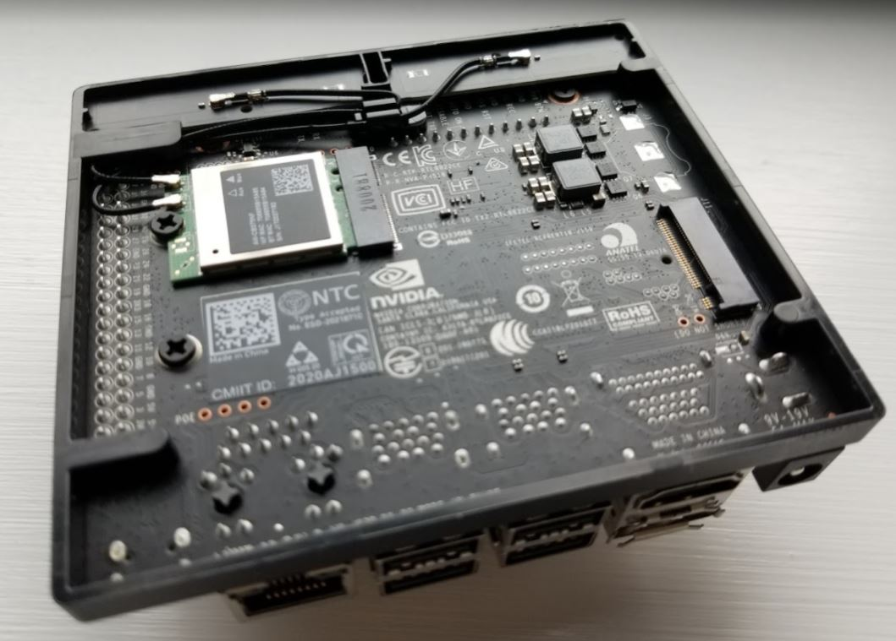
<br><em>Jetson Orin NX Developer Kit — ranura M.2 Key M para SSD NVMe</em>
</div>

<br>

**Procedimiento:**

1. Con la Jetson **completamente desconectada de la alimentación**, retirar la cubierta trasera del kit.
2. Insertar el SSD NVMe en la ranura M.2 Key M en ángulo (~30°).
3. Presionar hacia abajo hasta que quede plano y asegurar con el tornillo.
4. Verificar que el SSD quede firmemente instalado antes de continuar.

> ⚠️ NVIDIA recomienda un mínimo de **256 GB** en el SSD. Con menos capacidad la instalación puede completarse, pero el espacio para desarrollo será muy limitado.

---

## Paso 2 — ¿Por qué usar Ubuntu 22.04 en el host?

El SDK Manager solo es compatible con versiones específicas de Ubuntu en el PC host. **Ubuntu 22.04 LTS (Jammy) es la versión recomendada** para instalar JetPack 6.x.

| Ubuntu host | JetPack 6.x | Observación |
|---|:---:|---|
| Ubuntu 20.04 LTS | ✅ | Soportado pero no recomendado |
| Ubuntu 22.04 LTS | ✅ | **Recomendado** |
| Ubuntu 24.04 LTS | ❌ | No soportado — JetPack aparece como "Not available" |
| Windows / macOS | ❌ | No soportado |

La razón principal es que el SDK Manager descarga herramientas de compilación cruzada (`cross-compilation toolchain`) y dependencias del sistema que están empaquetadas para Ubuntu. La versión 24.04 tiene incompatibilidades con las bibliotecas internas del SDK Manager que aún no han sido resueltas por NVIDIA.

---

## Paso 3 — Descarga e instalación del SDK Manager

### 3.1 Descargar el SDK Manager

Ve a la página oficial y descarga el paquete `.deb` para Ubuntu:

> 📥 **[developer.nvidia.com/sdk-manager](https://developer.nvidia.com/sdk-manager#getting-started)**

Selecciona **"Debian Package (.deb)"** para Ubuntu x86_64.

### 3.2 Instalar el SDK Manager

Abre una terminal en el PC host y ejecuta:

```bash
sudo apt update
sudo apt install ./sdkmanager_<version>-<build>_amd64.deb
```

> Reemplaza `<version>-<build>` con el nombre del archivo descargado. Ejemplo:
> `sudo apt install ./sdkmanager_2.4.0.13236-1_amd64.deb`

### 3.3 Iniciar sesión con cuenta NVIDIA Developer

Abre el SDK Manager desde el menú de aplicaciones o desde la terminal:

```bash
sdkmanager
```

Al abrirse, aparecerá la pantalla de login. Selecciona la pestaña **"NVIDIA DEVELOPER"** e inicia sesión con tu cuenta de `developer.nvidia.com`. Si el navegador no abre automáticamente, puedes escanear el código QR que aparece en la pantalla.

<div align="center">
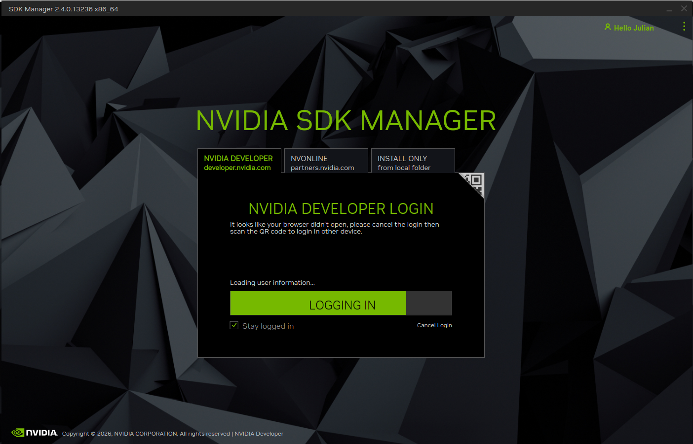
<br><em>Pantalla de login del SDK Manager — usar cuenta NVIDIA Developer</em>
</div>

Una vez ingresemos y sin configurar la Jetson en modo Recovery tendremos la siguiente imagen:

<div align="center">
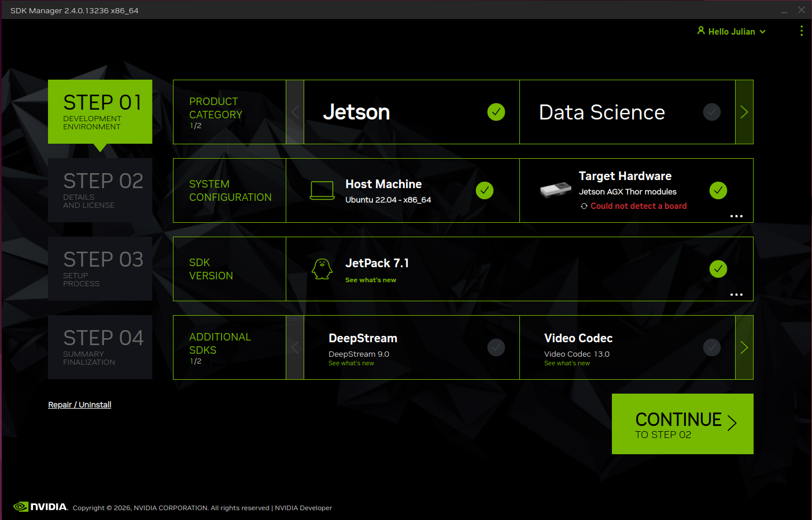
<br><em>Step 01 — Jetson Orin NX 16GB detectada, JetPack 6.2.2 seleccionado (sin SDKs adicionales)</em>
</div>

---

## Paso 4 — Modo Recovery (conexión de pines)

Para que el SDK Manager pueda flashear la Jetson, esta debe estar en **modo Recovery**. En este modo, la Jetson se presenta al PC host como un dispositivo USB especial y no arranca el sistema operativo.

### 4.1 ¿Cómo entrar en modo Recovery?

En la Jetson Orin NX Developer Kit, el modo Recovery se activa **cortocircuitando (puenteando) los pines de Recovery FC_REC** y GND, ubicados en la placa base antes de encender la Jetson.

<div align="center">
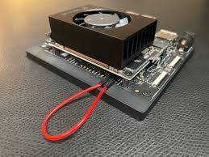
<br><em>Puentear los pines de Recovery con un jumper o cable antes de encender</em>
</div>

**Procedimiento:**

1. Con la Jetson **apagada y sin alimentación**, localiza los pines de Recovery en la placa base (marcados como `REC` o `RECOVERY` en el silkscreen).
2. Conecta un **jumper o cable corto** entre los dos pines de Recovery para cortocircuitarlos.
3. Conecta el **cable USB-C** entre el puerto USB-C de la Jetson y el PC host.
4. Conecta la **alimentación** de la Jetson — arrancará directamente en modo Recovery.

### 4.2 Verificar que la Jetson está en modo Recovery

En el PC host, ejecuta:

```bash
lsusb | grep -i nvidia
```

Debes ver una línea como:
```
Bus 00X Device 00X: ID 0955:7323 NVIDIA Corp. APX
```

La presencia de `NVIDIA Corp. APX` confirma que la Jetson está en modo Recovery y el SDK Manager podrá detectarla.

> ⚠️ **Importante:** El jumper de Recovery **solo se necesita para el primer flash**. Una vez que el sistema esté instalado, la Jetson arrancará normalmente sin el jumper. Para reflashear en el futuro, se puede activar Recovery desde el software o manteniendo presionado el botón de Recovery al encender (en kits que lo tienen).

---

## Paso 5 — Proceso dentro del SDK Manager

### Step 01 — Development Environment

Con la Jetson en modo Recovery y conectada por USB-C, el SDK Manager la detectará automáticamente. Verás la pantalla de configuración del entorno de desarrollo.

**Configuración correcta para la Jetson Orin NX 16 GB:**

- **Product Category:** `Jetson` ✅
- **Hardware Configuration → Host Machine:** `Ubuntu 22.04 - x86_64` ✅
- **Hardware Configuration → Target Hardware:** `Jetson Orin NX modules` → `Jetson Orin NX 16GB` ✅
- **SDK Version:** `JetPack 6.2.2` ✅
- **Additional SDKs:** DeepStream y GXF Runtime (opcionales, seleccionar según necesidad)

<div align="center">

<br><em>Step 01 — Jetson Orin NX 16GB detectada, JetPack 6.2.2 seleccionado (sin SDKs adicionales)</em>
</div>

<br>

<div align="center">
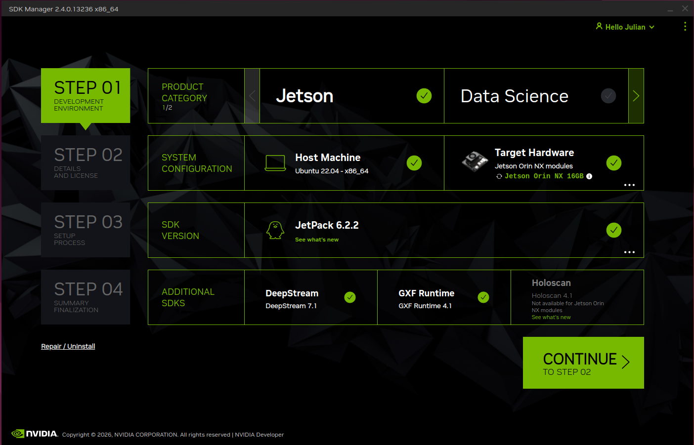
<br><em>Step 01 — Con DeepStream 7.1 y GXF Runtime 4.1 seleccionados</em>
</div>

> **Nota:** Si el SDK Manager muestra `Jetson AGX Thor modules` o `Could not detect a board`, verifica la conexión USB-C y que la Jetson esté correctamente en modo Recovery. Usa el botón **"refresh"** del campo Target Hardware.

Haz clic en **CONTINUE TO STEP 02**.

---

### Step 02 — Details and License

Esta pantalla muestra todos los componentes que serán descargados e instalados, divididos en dos secciones:

**HOST COMPONENTS** — se instalan en el PC host:
- CUDA Toolkit (4,116 MB)
- NvSci (0.5 MB)
- Computer Vision (92.1 MB)
- Developer Tools (749.6 MB)
- GXF (1,527 MB)

**TARGET COMPONENTS** — se flashean en la Jetson:
- Jetson Linux Image (2,455 MB)
- Flash Jetson Linux
- Jetson Runtime Components + Additional Setups

Selecciona todos para instalar todas las herramientas.

<div align="center">
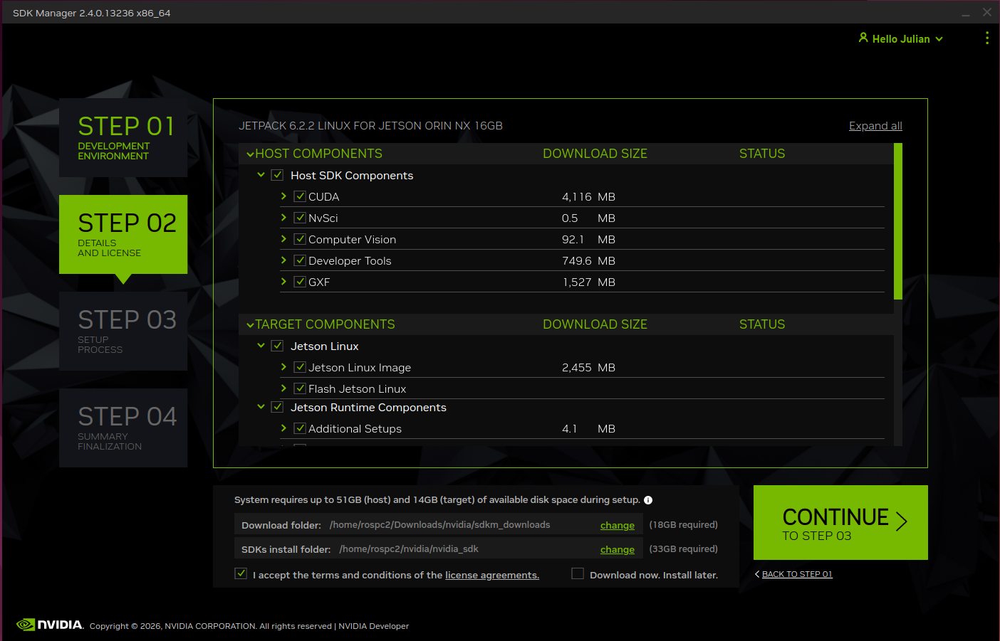
<br><em>Step 02 — Componentes a descargar e instalar. El sistema requiere ~51 GB en el host</em>
</div>

<br>

Al hacer clic en **CONTINUE TO STEP 03**, si las carpetas de descarga e instalación no existen, el SDK Manager preguntará si deseas crearlas. Haz clic en **Create**:

<div align="center">
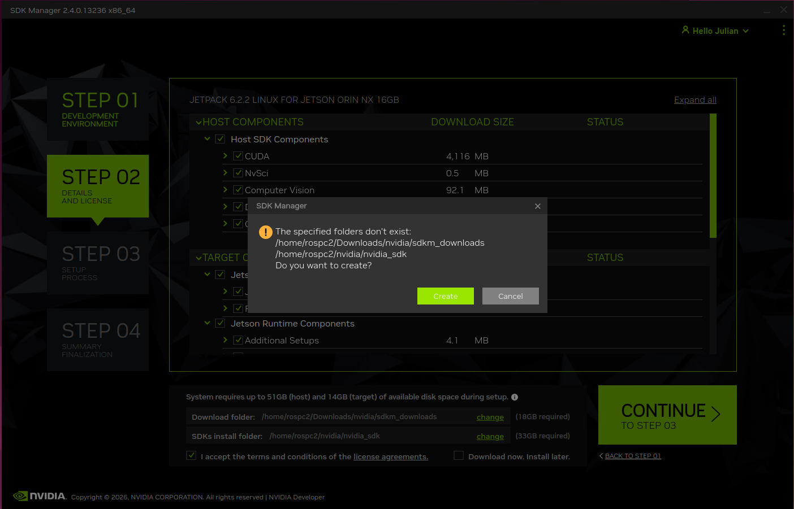
<br><em>Crear las carpetas automáticamente al continuar</em>
</div>

---

### Step 03 — Setup Process (Descarga y Flash)

El SDK Manager comenzará a descargar todos los componentes e instalarlos en paralelo. Este proceso puede tomar entre **30 minutos y 2 horas** dependiendo de la velocidad de internet.

<div align="center">
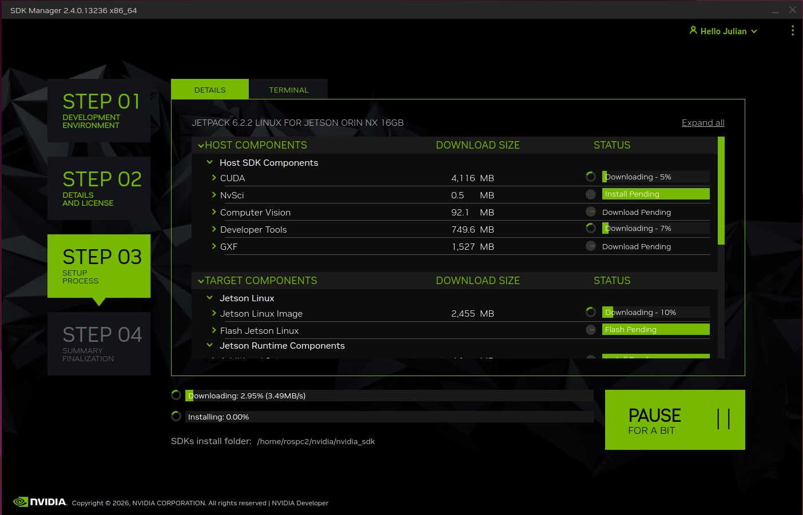
<br><em>Step 03 — Descarga e instalación en progreso. Se puede monitorear en la pestaña TERMINAL</em>
</div>

<br>

Cuando la descarga del sistema operativo esté lista, el SDK Manager mostrará el **diálogo de configuración del flash**. Aquí se define cómo se instalará el sistema en la Jetson:

<div align="center">
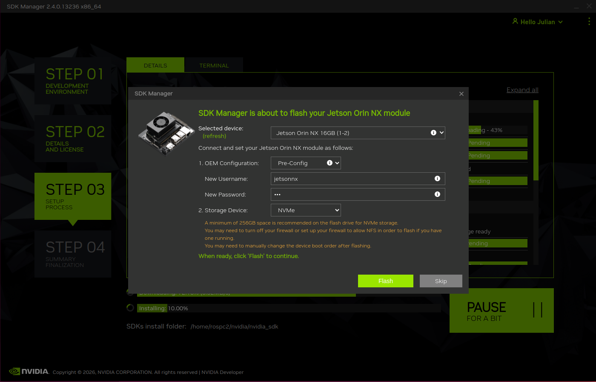
<br><em>Diálogo de flash — primera aparición mientras el SDK continúa descargando</em>
</div>

<br>

**Configurar el flash con los siguientes parámetros:**

| Campo | Valor |
|---|---|
| Selected device | `Jetson Orin NX 16GB (1-2)` |
| OEM Configuration | `Pre-Config` |
| New Username | tu usuario (ej: `jetsonnx`) |
| New Password | tu contraseña |
| Storage Device | **`NVMe`** |

> ⚠️ **Seleccionar `NVMe`** en Storage Device es crítico. Si dejas la opción por defecto (eMMC o SD), el sistema se instalará en la memoria interna del módulo en lugar del SSD.

<br>

Haz clic en **Flash**. El SDK Manager comenzará a escribir la imagen en el SSD.

Mientras el flash ocurre, el SDK Manager verificará la preparación del sistema en la Jetson:

<div align="center">
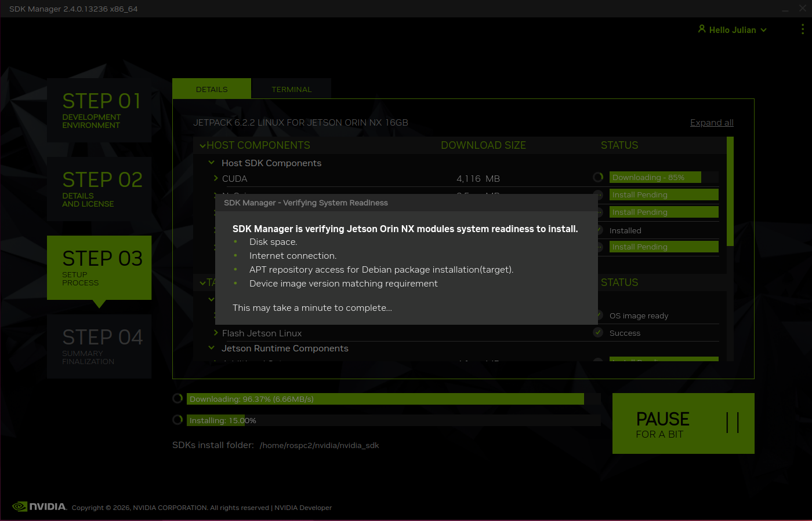
<br><em>Verificando: espacio en disco, acceso a internet, repositorios APT e imagen del sistema</em>
</div>

---

### Step 04 — Summary / Finalization

Cuando todos los componentes estén instalados correctamente, el SDK Manager mostrará la pantalla de finalización con el estado **"INSTALLATION COMPLETED SUCCESSFULLY"**.

<div align="center">
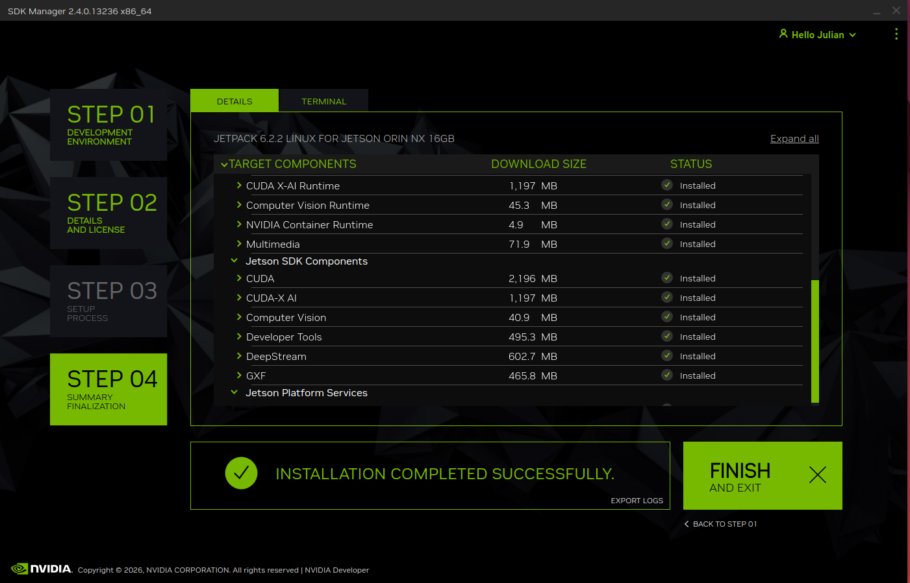
<br><em>Step 04 — Todos los componentes instalados correctamente en la Jetson Orin NX 16GB</em>
</div>

<br>

Los componentes instalados en la Jetson incluyen:

| Componente | Tamaño | Estado |
|---|---|---|
| CUDA X-AI Runtime | 1,197 MB | ✅ Installed |
| Computer Vision Runtime | 45.3 MB | ✅ Installed |
| NVIDIA Container Runtime | 4.9 MB | ✅ Installed |
| Multimedia | 71.9 MB | ✅ Installed |
| CUDA | 2,196 MB | ✅ Installed |
| CUDA-X AI | 1,197 MB | ✅ Installed |
| Computer Vision | 40.9 MB | ✅ Installed |
| Developer Tools | 495.3 MB | ✅ Installed |
| DeepStream | 602.7 MB | ✅ Installed |
| GXF | 465.8 MB | ✅ Installed |

Haz clic en **FINISH AND EXIT**.

---

## Paso 6 — Verificación por SSH

Una vez completada la instalación, la Jetson reiniciará y arrancará en Ubuntu 22.04. Puedes verificar que todo funciona correctamente conectándote por SSH usando el cable USB-C.

### 6.1 Conectar por SSH

Con el cable USB-C aún conectado entre la Jetson y el PC host, la Jetson expondrá una interfaz de red virtual. Desde el PC host:

```bash
ssh jetsonnx@192.168.55.1
```

> La IP `192.168.55.1` es la dirección fija que la Jetson asigna a la interfaz USB virtual. Reemplaza `jetsonnx` con el usuario que configuraste en el Step 03.

La primera vez, SSH pedirá confirmar el fingerprint del host. Escribe `yes`:

<div align="center">
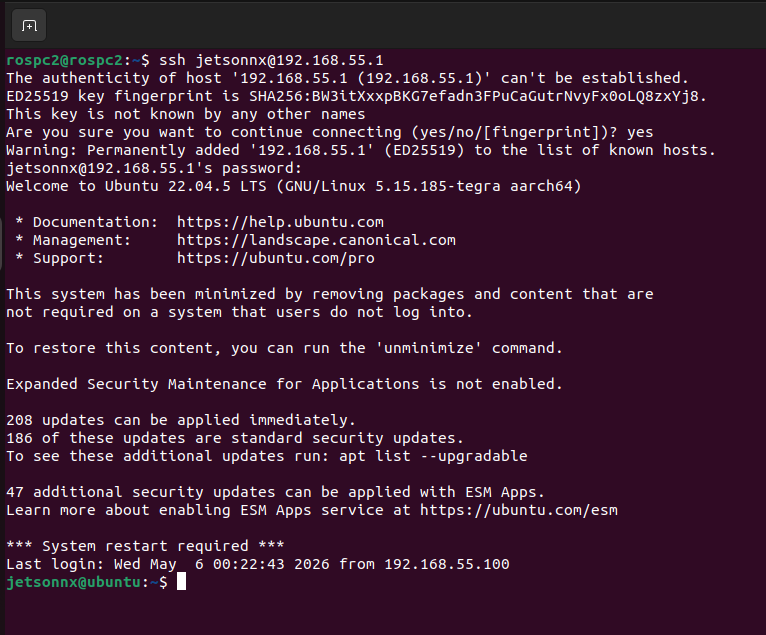
<br><em>Conexión SSH exitosa — Ubuntu 22.04.5 LTS corriendo en la Jetson Orin NX (aarch64)</em>
</div>

---

### 6.2 Verificar versión de Ubuntu

```bash
lsb_release -a
```

<div align="center">
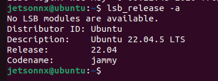
<br><em>Ubuntu 22.04.5 LTS Jammy confirmado en la Jetson Orin NX</em>
</div>

Salida esperada:
```
Distributor ID: Ubuntu
Description:    Ubuntu 22.04.5 LTS
Release:        22.04
Codename:       jammy
```

---

### 6.3 Verificar CUDA y drivers NVIDIA

```bash
nvidia-smi
```

<div align="center">
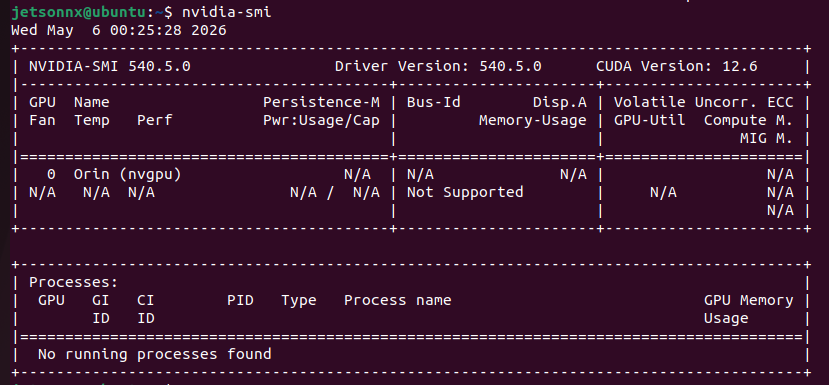
<br><em>nvidia-smi — CUDA 12.6 y Driver 540.5.0 funcionando en la Jetson Orin NX (GPU Orin nvgpu)</em>
</div>

Salida esperada:
```
NVIDIA-SMI 540.5.0    Driver Version: 540.5.0    CUDA Version: 12.6
GPU: Orin (nvgpu)
```

---

### 6.4 Resumen de verificación

| Verificación | Comando | Resultado esperado |
|---|---|---|
| Ubuntu instalado | `lsb_release -a` | Ubuntu 22.04.5 LTS Jammy |
| Arquitectura | `uname -m` | `aarch64` |
| Driver NVIDIA | `nvidia-smi` | Driver 540.5.0 |
| CUDA | `nvidia-smi` | CUDA Version 12.6 |
| nvcc disponible | `nvcc --version` | CUDA 12.x |

Si todos los comandos responden correctamente, la Jetson Orin NX está lista para continuar con la instalación de ROS 2 Humble.

---

<div align="center">

[← Volver al README principal](../../README.md) &nbsp;|&nbsp; [Instalar ROS 2 Humble →](ubuntu-deb.md)

**Referencias:** [NVIDIA SDK Manager](https://developer.nvidia.com/sdk-manager) &nbsp;|&nbsp; [JetPack 6.2 Release Notes](https://developer.nvidia.com/embedded/jetpack-sdk-62)

</div>
